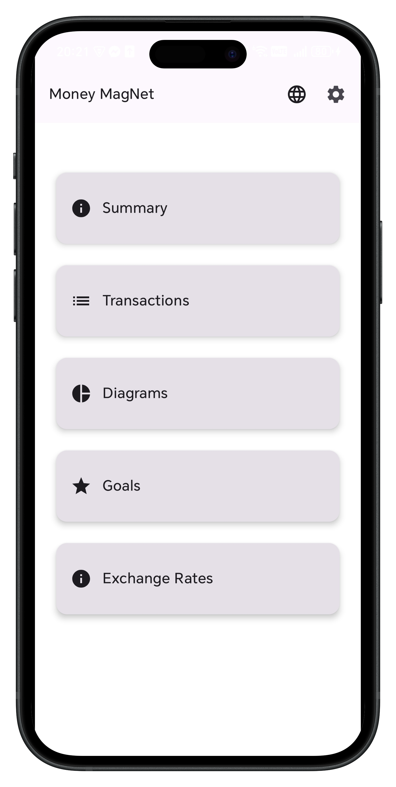
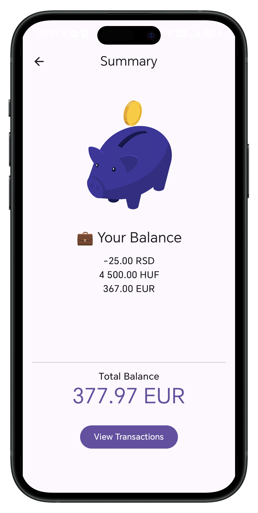
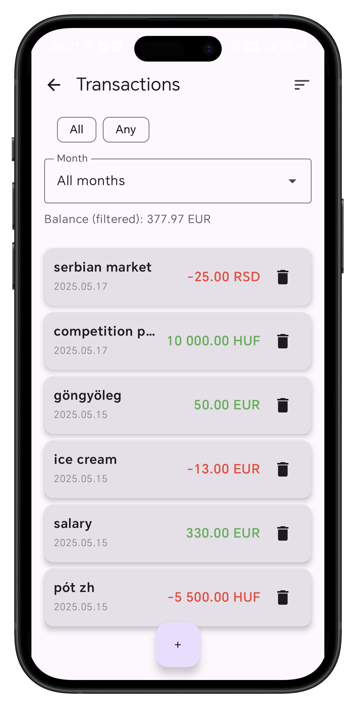
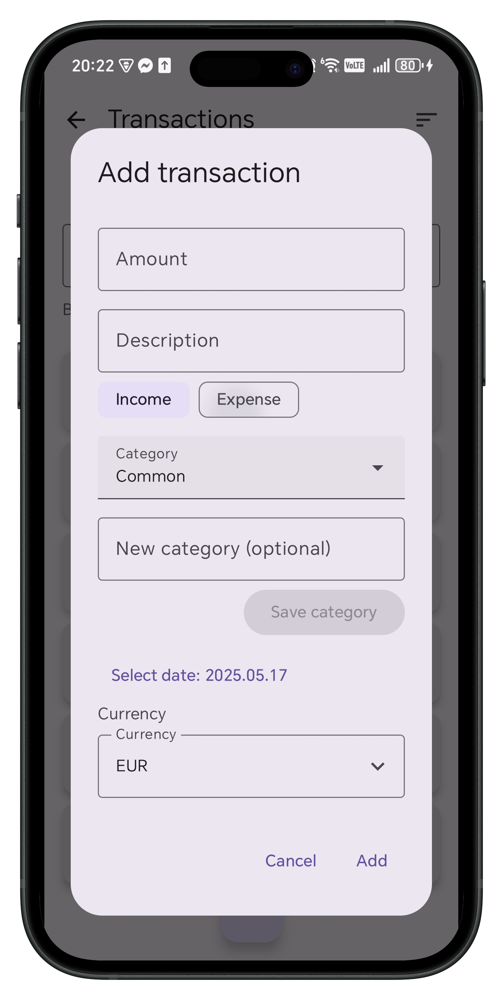
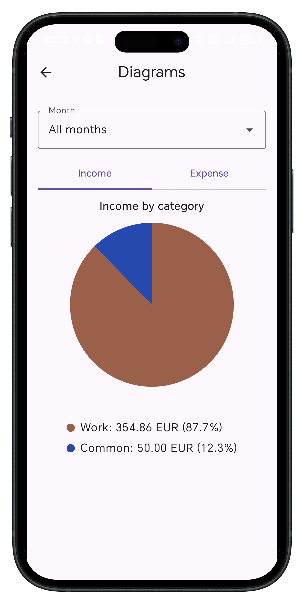
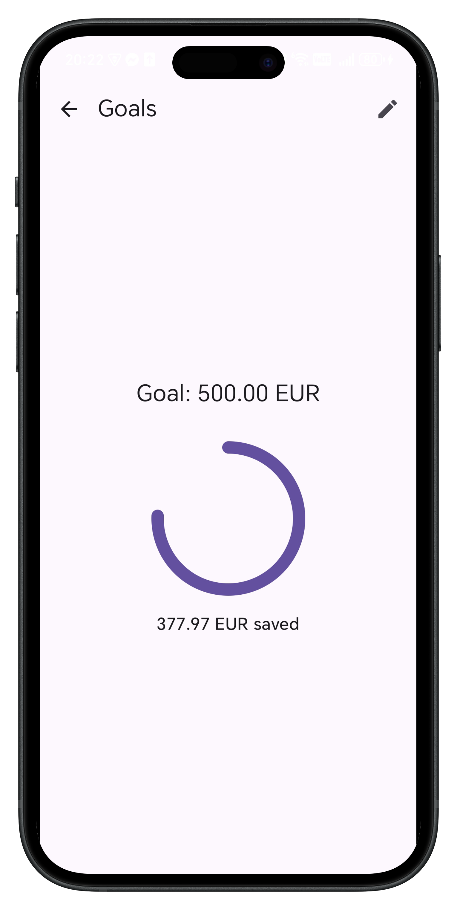

### MoneyMagNet

1. ábra: Ikon 
	

	

## Telepítés

a) opció: A projekt gyökér mappájában található app-release.apk fájlt a telefonra másolva és telepítve lehet kipróbálni. Első telepítésnél a Google ellenőrizni szeretné, mert még nem találkozott ezzel az alkalmazással. Vagy előfordul, hogy a telefon beállításaiban engedélyezni kell az ebből a forrásból (pl Google Drive, ha linkről töltjük le) származó alkalmazás telepítését. 

b) opció: a projektet letöltve és AndroidStudio-ban futtatva emulátoron is kipróbálható

## Bemutatás: elérhető szintén a gyökér mappában egy rövid bemutató videó a működésről és a főbb funkciókról.
Az alkalmazás egy kiadás és bevétel követő rendszer, ami segít átláthatóbbá tenni a felhasználó számára a pénzügyeit.
A célközönség elsősorban diákok, fiatal felnőttek, akik szeretnék tudatosan kezelni a pénzüket. Olyanok, akik többféle pénznemben mozgatják a pénzüket, és egy tiszta, átfogó képet szeretnének kapni erről. 
De igazából bárki, aki szereti a látványos grafikonokat, vagy úgy érzi, motiválná a megtakarításai gyűjtögetésében egy animációkkal kiegészített alkalmazás. 

## Főbb funkciók

A felhasználó meg tudja adni a bevételét, kiadásait. (Pozitív és negatív irányú pénzmozgás.)
Ezen kívül be lehet állítani az elérni kívánt cél összeget.
Ezek ábrázolása diagramon, grafikonon. Meg lehet nézni a napi árfolyamokat minden valutára. 

## Felhasználói kézikönyv

Az alkalmazást angol és magyar nyelven készítettem el, a nyelvek között a kis földgömb ikonra kattintva lehet váltani az alkalmazáson belül a menü képernyőről.

Belépve egy főmenü fogad minket, ahonnan öt irányba indulhatunk el. 
- Summary / Összegzés
- Transactions / Tranzakciók
- Diagrams / Diagramok
- Goals / Célok
- Exchange Rates / Árfolyamok
  

2. ábra: Menü

    

A képen a menü látható, ami az alkalmazásba belépve fogad.

A Tranzakció

Egy tranzakciónak magán az összegen kívül (**Amount/Összeg**) van egy **Description-je/Leírás-a**, ez alapján a felhasználó könnyebben be tudja azonosítani. Tartozik hozzá még egy **Category/Kategória**, amit egy előre megadott listából lehet kiválasztani, de sajátot is lehet hozzáadni, és a saját kategóriákat törölni is lehet később. (Ekkor egy megerősítő képernyő jelenik meg, ami megkérdezi, tényleg szeretnénk-e törölni, és ha igen, akkor az összes ebbe a kategóriába tartozó tranzakció átkerül a Common nevű kategóriába. Vagy mégsem szeretnénk törölni.) Ezen kívül van egy **Date/Dátum** is hozzá, amit lehet változtatni, illetve az alkalmazás elmenti a tranzakció létrehozásának helyét, (**Location/Hely**) és ezt a koordinátát meg tudjuk nézni a Google Maps-en a "Show on map/Mutatás a térképen" gombbal. Ehhez az szükséges, hogy a felhasználó megadja az **engedélyt**, ami az új tranzakció létrehozásánál ugrik fel. Illetve tartozik még hozzá egy (**Currency/Pénznem**), amit minden tranzakcióhoz egyedileg ki lehet választani, vagy ha nem választunk, akkor a (**Settings/Beállítások**)-ban beállított alapértelmezett pénznemet használja.

A képernyők

  A Summary képernyőn egy malacpersely animáció található, alatta pedig az alkalmazásban megadott tranzakciókból kiszámolt pénzmennyiség. Vagyis az egyenleg. Ez először görgethető listában is meg van adva, összegezve a különböző pénznemeket, alatta pedig a teljes vagyon, az alapértelmezett, globálisan beállított pénznemben. Innen a gombra kattintva szintén elnavigálhatunk a Transactions képernyőre, ahol láthatjuk, pontosan miből számolta ki ezt az egyenleget.

3. ábra: Egyenleg és tranzakciók

 

Az első képen az összefoglaló oldal látható, a jobb oldalon pedig a tranzakciók listája.
	
A Transactions képernyő tehát egy lista, minden eleme egy Transaction, egy bevételt vagy egy kiadást reprezentál. Ezen az oldalon lehetőségünk van **rendezni** a listát, sok sok opció szerint (tranzakció időpontja, kategóriája, összeg nagysága...). Illetve **szűrni** is tudunk, ha például csak a bevételeket, csak a kiadásokat, vagy csak egy adott kategória elemeit szeretnénk látni. A listában csak a Description/Leírás mező látszik, a dátum és az összeg, a többi részletért rá kell kattintatni a listaelemre, amikoris megnyílik a részletes tranzakció leíró képernyő, és ennek a jobb alsó sarkában a **szerkesztés gomb**. 

Még mielőtt oda navigálnánk, a lista nézetben található egy + gomb, amivel **hozzáadhatjuk** az új tranzakciót. Ezt meg lehet tenni úgy is, hogyha nem szeretnénk neki leírást adni, csak az összeget kötelező kitölteni, a többi mező automatikus, vagy nem kötelező. 

Amikor a felhasználó egy Income/Bevétel-t rögzít a listába, akkor az ablak bezáródása után egy **pénzeső animációt** láthatunk lejátszódni, ami kb 1 másodperces, és konfettiként is lehet rá tekinteni, de igazából papírpénz hullik a képernyőn, ezzel is motiválva a felhasználót a bevételei rögzítésére. 

4. ábra: Hozzáadás

 
A képen a tranzakciót hozzáadó dialógus látható
	
A harmadik képernyő a Diagrams/Diagramok képernyő. Ebben a menüben is egy kis animáció látható. Itt kétféle statisztikát tudunk megnézni a tranzakcióinkról: egy **kördiagramot**, ahol a kategóriák szerinti eloszlást lehet látni, itt is lehetőség van hónapra, bevételre/kiadásra **szűrni**, és a diagram **animáltan** jelenik meg. Minden belépéskor más színeket használ az egyes szeletekhez. A másik opció, egy **oszlopdiagram**, ahol a bevételeinket hasonlíthatjuk össze a kiadásainkkal. 

5. ábra: Beállítások és árfolyamok

 
A képen a beállítás(ok) és a napi árfolyamok láthatók
	
A beállításokban most csak egy dolgot lehet beállítani, az alapértelmetett pénznemet, ebben számolja az összegzést és a diagramokat is az ebbe átszámolt összeg alapján készíti el, illetve az (**Exchange Rates/Árfolyamok**) képernyőn is ehhez számolja ki az összes többi árfolyamot (pl.: EUR van beállítva, akkor 1 HUF = xyz EUR szerepel az árfolyamok képernyőn.) Az utolsó frissítés időpontja is itt látható, ez megjelenik az árfolyamoknál is. Mivel rengeteg pénznemből lehet választani, ez a lista kereshető. (A beállításoknál a lista lenyitása után felül megjelenik a kereső mező, amivel szűkíteni lehet a pénznemek listáját.)

6. ábra: Diagramok

 
Az első képen a kördiagram, a jobb oldalon pedig az oszlop.
	
Az (egyelőre) utolsó képernyő a **Goals/Célok**
Ebben a menüpontban megadhatunk egy összeget, amit el szeretnénk érni, és egy kördiagramon láthatjuk, mennyire vagyunk még a céltól. Amikor a megtakarított összeg eléri (>=) a cél összeget, egy aranyos táncoló galamb animációt kapunk, ami addig táncol, amíg a felhasználó be nem zárja.

7. ábra: Célok

 

Az első képen a cél beállítása után vagyunk, a másodikon pedig a cél elérése után játszódó animáció.

## Felhasznált technológiák:

- [Lottie Compose](https://github.com/airbnb/lottie/blob/master/android-compose.md) az animációkhoz, Lottie fájlok megjelenítésére és vezérlésére
- [Room](https://developer.android.com/jetpack/androidx/releases/room) adatbázis az SQLite-alapú perzisztenciához, beleértve egyedi TypeConverter-t (LocalDateConverter) a LocalDate mezők kezelésére
- [Hilt](https://dagger.dev/hilt/) (Dagger-Hilt) dependency injection a ViewModel-ek, repository-k és DAO-k egyszerű injektálásához
- [Navigation Compose](https://developer.android.com/develop/ui/compose/navigation) a képernyők közötti navigáció deklaratív, visszakövethető kezeléséhez
- [Play Services Location](https://developers.google.com/android/reference/com/google/android/gms/location/LocationServices) (FusedLocationProviderClient) a tranzakciók geotag-eléséhez, felhasználói pozíció lekérdezésére
- [ActivityResultContracts.RequestPermission](https://developer.android.com/reference/androidx/activity/result/contract/ActivityResultContracts.RequestPermission) futásidőbeli jogosultság-kezelés a helyszíni adatok biztonságos lekéréséhez
- [Implicit Intent](https://developer.android.com/guide/components/intents-filters) használata térképalkalmazás megnyitására geo: URI-val a “Mutatás térképen” gombbal
- [Retrofit](https://square.github.io/retrofit/) könyvtárral hálózat elérése a napi árfolyamhoz
- [Árfolyamok](https://www.exchangerate-api.com/) Exchangerate-api-val, egy ingyenes API kulcsot használva, ami havi 1500 lekérést tesz lehetővé, napi 1 db lekérést indít az alkalmazás.
- Az alapértelmezett pénznem és az árfolyamok a [Jetpack DataStore](https://developer.android.com/topic/libraries/architecture/datastore) segítségével kerülnek lokálisan elmentésre, így internetkapcsolat nélkül is, vagy ha elfogy az ingyenes lekérdezések száma, működőképes marad az app az utoljára ismert árfolyamokkal. Ezt a felhasználó az árfolyamoknál kiírt "utoljára frissítve" üzenetből veheti észre

  ## Későbbre Todo-k:
  - a location lehetne módosítható, térképen választható ponttal
  - felhasználói fiók regisztrálása
  - több különböző zseb/célt lehessen beállítani, pl. külön malacpersely 1 adott célra
  - autocomplete text (új kategória megadásánál, tranzakció nevének beírásakor)
  - engedély elkérésénél tájékoztató!
  - settings screen elég üres, a nyelv beállítás is lehetne ott ill. hozzáadni további beállítási lehetőségeket (sötét téma...)
  - pénzösszeg nagysága szerinti szűrésnél csak a számot nézi, nem váltja át a valutát :)
  - oszlopdiagramok szebben pozicionálása, animáció kicsit lassú
  - kördiagramoknál rossz cím van
  - api kulcs hardcodeolva
  - értesíteni a felhasználót ha a napi árfolyam lekérése meghiúsult
